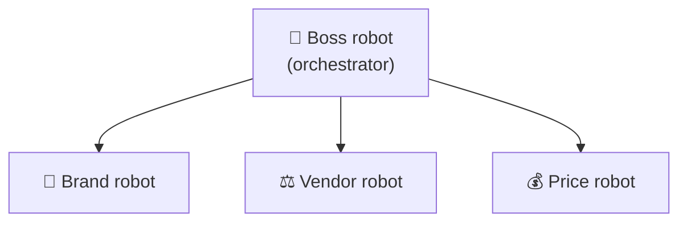
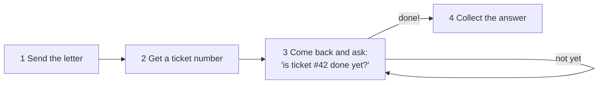
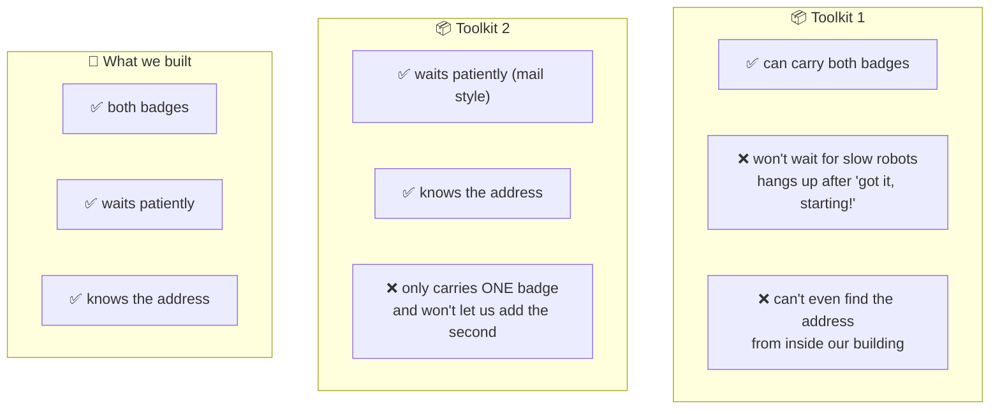

# Why we wrote our own messenger — explained very simply

This explains the thing in `vibeflix_common/a2a_engine.py`, with no jargon.
If you want the version for engineers, read
[`eng-report/UPSTREAM-FR-a2a-client-gaps.md`](eng-report/UPSTREAM-FR-a2a-client-gaps.md).

---

## The story

Imagine our system is a **big office building full of robot helpers**.

Each robot has one job. One checks that a picture follows the brand rules. One checks the vendor
is allowed to make the toy. One checks the price is fair. A **boss robot** gives out the work and
collects the answers.



Here is the catch: **each robot lives in its own separate building.** They can't just turn around
and talk. They have to send messages across town.

---

## Problem 1 — the robots are slow, and the phone hangs up

You'd think the boss robot could just **phone** the brand robot and wait on the line for the
answer. That's what we tried first.

But the phone company (the part Google runs) has a bug. The call connects, the other robot says
**"got it, I'm starting!"** — and then the line goes dead. You never hear the actual answer, even
though the robot really did finish the work.

```
☎️  Boss: "Please check this picture."
☎️  Brand robot: "Got it, starting!"
☎️  ...click. Line dead. 😐
     (the robot DID finish — you just never heard it)
```

So phoning is out. Instead we do it like **mail**:



Step 3 is called **polling** — just politely asking again and again until it's ready. It's boring,
but it *works*. That's the important part.

---

## Problem 2 — the security guard needs two badges

Our building has a **security guard** at the door (this is the "gateway"). The guard is there on
purpose — he stops robots from wandering off and talking to strangers. Good!

But he makes the mail complicated. To deliver one letter you need **two badges**:

| Badge | Who checks it |
|---|---|
| 🪪 **Badge 1** | the **security guard** — "are you allowed to leave and go there?" |
| 🪪 **Badge 2** | the **other building's** front desk — "are you allowed in here?" |

Show only one badge and you get turned away. And nobody wrote this down anywhere — we found it out
by getting turned away over and over until we worked out what was missing.

You also have to go to the **exact address on the guard's approved list**. There are two doors to
the same building, and if you knock on the one that isn't on his list, he says no — even though
it's the same building.

---

## Problem 3 — the two ready-made toolkits each forgot one thing

Google gives us two ready-made "mail robot" toolkits, so we shouldn't have to build our own.
We tried both. **Each one is missing exactly one thing we need.**



**Toolkit 1** is happy to carry both badges — but it hangs up early, just like the phone. And
before it even starts, it has to look up the address in a directory across town, which our
security guard won't let it visit. So it fails before it begins.

**Toolkit 2** waits patiently and knows the address — it does the mail trick perfectly. But it
makes its own badge, only ever *one* badge, and there's no slot to add the second one. It's sealed
shut.

So: neither toolkit works, and it's for **different reasons each time**. That's why we wrote our
own little mail robot. It's about 320 lines. It carries two badges, knocks on the right door, and
politely asks "done yet?" until the answer is ready.

---

## Was it a mistake to build our own?

No — and we checked carefully, twice.

The way we built ours is the **same way Google's own instructions say to do it**. We're not being
clever or going around anything. We're doing the documented thing; the ready-made toolkits just
can't do it yet.

---

## What we're asking Google for

Just **one** small fix — either one would do, we don't need both:

1. **Let Toolkit 2 take our badges.** Right now it makes its own. Let us hand it ours instead.
   Then we delete most of our mail robot. *(Toolkit 1 already allows this — so it's clearly a
   reasonable thing to allow.)*
2. **Teach Toolkit 1 to wait**, and let it find the address without the trip across town.

We'd also love them to **write the two-badge rule down**, so the next team doesn't spend days
getting turned away at the door like we did.

---

## The one-sentence version

> Our robots are in different buildings, the phone line drops after "hello", the security guard
> wants two badges, and neither ready-made mail robot can do both — so we wrote a small one that
> can, and we've asked Google to fix theirs.
