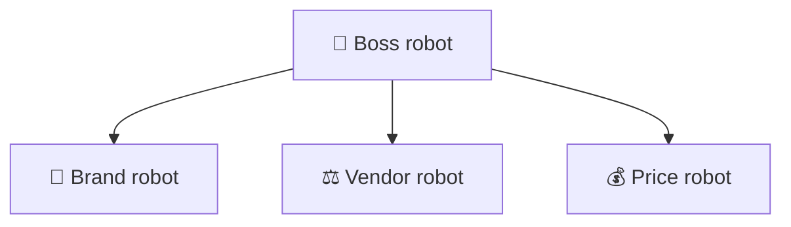
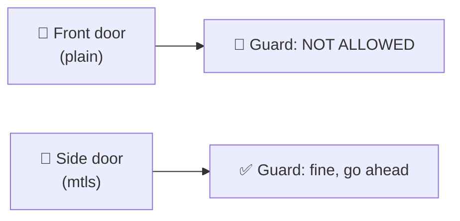
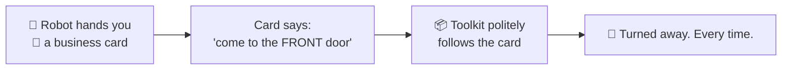
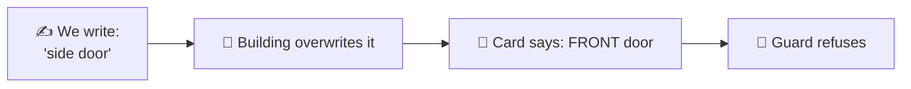
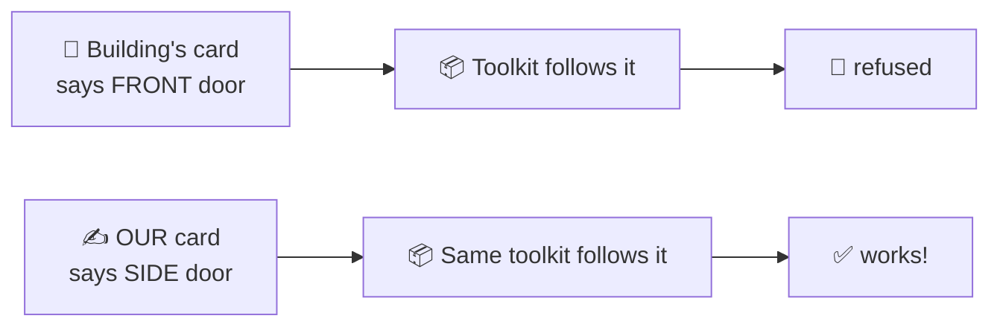

# Why we wrote our own messenger — explained very simply

This explains `vibeflix_common/a2a/engine.py`, with no jargon.
Engineer version: [`eng-report/UPSTREAM-FR-a2a-client-gaps.md`](eng-report/UPSTREAM-FR-a2a-client-gaps.md).

> **Updated 2026-08-02.** We finally ran the real test in production, and **most of what this page
> used to say was wrong.** The corrections are kept in, because being wrong and finding out is the
> most useful part of the story. 🔎

---

## The story

Our system is a **big office building full of robot helpers**. Each has one job — checking the
brand rules, checking the vendor, checking the price — and a **boss robot** hands out work and
collects answers.

Each robot lives in a **separate building**, so they send messages across town. And there's a
**security guard** who only lets robots contact approved addresses.

---

## 🔎 Everything we believed, and what was actually true

We had a tidy explanation. We tested it properly. Almost all of it fell over.

| What we believed | What the test showed |
|---|---|
| ☎️ "Long calls get cut off" | ❌ **Wrong.** A 3-minute call worked perfectly. |
| 🚪 "The guard won't let us look up addresses" | ❌ **Wrong.** Looking up addresses works fine. We'd just forgotten to give ourselves a key once. |
| 🪪 "You need two badges to get through" | ❌ **Wrong.** One badge is enough. |
| 📻 "The guard bans live commentary" | ❌ **Wrong.** He allows it. |
| 📣 "Our robots advertise the wrong service" | ❌ **Wrong.** Changing that didn't help either. |
| 📮 "The ready-made toolkit can't do the job" | ✅ **True — but for a completely different reason.** |

That last row is the real story.

---

## The actual problem: every robot hands out the wrong address

Each building has **two doors**: a front door and a side door. They both lead to the same robot.

The guard only ever allows the **side door**. Always. We tested this against three different
robots, in every way we could think of — the side door works, the front door never does.

**Now the problem.** Every robot hands visitors a little **business card** with its address on it.
And the card says… **the front door.** The one that never works.

So the ready-made toolkit does exactly the right thing — reads the card, goes to the address on
it — and gets refused. Forever.

**Our own messenger works because it ignores the card.** It was hardcoded long ago to always use
the side door. That wasn't clever planning; it just happens to be right.

---

## The part that makes this a real bug

We thought: *fine, we'll just print better business cards.* So we tried — we set one robot's card
to say "side door".

**The building printed the front door anyway.** 🤯

It turns out the card isn't written by us at all. The building's own system overwrites it every
time the robot starts up, and always writes the front door — the one its own guard refuses.

So this isn't something we misconfigured. **The building hands out an address its own guard has
banned, and there's no setting to change it.** We looked for a switch. There isn't one.

That's what we're reporting to Google.

---

## 🎉 But we found a way around it

Here's the happy ending: **you don't have to use the card the robot hands you.**

The ready-made toolkit will accept a card *you* write. So we wrote our own card, put the **side
door** on it, and handed it to the toolkit instead.

We tested both **in the real system, side by side, in the same minute**. The building's card got
turned away. Ours got through and came back with a real answer.

That means we *can* use the ready-made toolkit after all — we just have to write the address down
ourselves first. About ten lines, instead of the several hundred in our own messenger.

---

## So why do we still have our own messenger?

Honestly? **Less than we thought.**

- ✅ **Still useful:** it's sturdy. It renews expired passes mid-wait, copes when a building is
  briefly unreachable, and keeps checking back until the answer is really ready.
- ⚠️ **No longer a reason:** the phone, the badges, the address lookup — we were wrong about all
  three. A ready-made toolkit can do those.
- 🤔 **Honest answer:** we built it around problems that mostly weren't real. It works well and
  we're keeping it for now, but we can't claim it was the only option.

---

## What we're actually asking Google for

Only what we can prove:

1. **Print the right address on the business card.** The building writes the front door onto
   every robot's card, and its own guard bans the front door. This is the big one — and nobody
   using the platform can fix it themselves.
2. **Fix a toolkit that breaks silently** — it stops working with no error message at all, just a
   confusing crash later.
3. **Write down which door is the right one.** It appears in no documentation. We found it by
   being turned away, repeatedly.

---

## The lesson worth keeping

> We had a confident, tidy explanation for months. It was mostly wrong. One careful test in the
> real system replaced four guesses with one small, fixable fact.

---

## The one-sentence version

> Every robot hands out a business card printed by the building itself, showing a door the
> building's own guard has banned — so the standard toolkit follows the card and gets turned away,
> while our messenger works only because it ignores the card and uses the other door.
