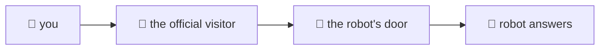
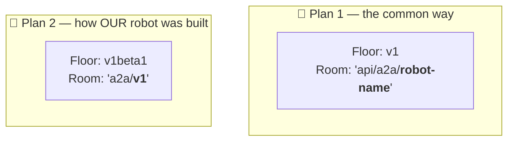
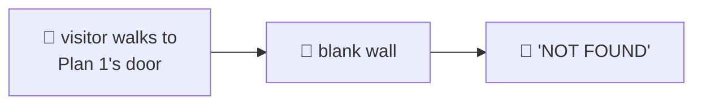
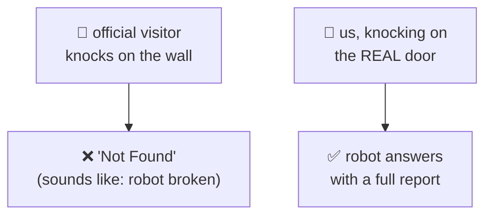
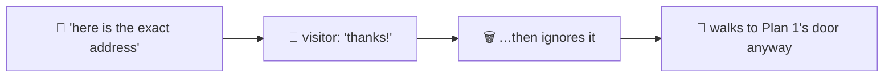
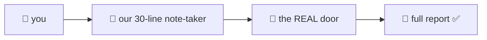
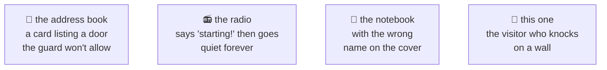

# The visitor who knocks on a wall — explained very simply

This is the simple version of **FINDING F** in
[`eng-report/UPSTREAM-FR-a2a-client-gaps.md`](eng-report/UPSTREAM-FR-a2a-client-gaps.md).
It's a bug we found in Google's own tool and reported to them.

Related simple explainers: [`A2A-ELI5.md`](A2A-ELI5.md) (why we wrote our own messenger) ·
[`SSE-BUG-ELI5.md`](SSE-BUG-ELI5.md) (the radio that only announces the start) ·
[`TOKEN-AUTH-ELI5.md`](TOKEN-AUTH-ELI5.md) (the badges) ·
[`PLAYGROUND-BUG-ELI5.md`](PLAYGROUND-BUG-ELI5.md) (the notebook with the wrong name).

---

## The setup

Our robot lives in an office building. To ask it a question, you walk to its door and knock.

Google gives you an **official visitor** — a little helper program whose whole job is walking to
a robot's door and knocking for you. Very handy. You just tell it which building.

---

## The problem: there are two building plans

Robots can be built in **two different ways**. Both are official. Both are fine. But they lay
out the building differently — the robot's door ends up in a different place.

The official visitor was only ever taught **Plan 1**.

Our robot lives in a **Plan 2** building.

So the visitor walks confidently to where the door should be… and there's just **wall**.

---

## The bit that makes it really annoying

When the visitor finds a wall, it comes back and says:

> ❌ *"Not Found."*

Which sounds an awful lot like **"your robot is broken"** or *"your robot isn't there."*

**But the robot is completely fine.** We walked to the *real* door ourselves and knocked, and it
answered straight away with a full, correct report. 🤖✅

So the message points at the wrong thing entirely. You go off hunting for a problem with your
robot, and there isn't one.

---

## The bit everyone guesses wrong

Most people hear this and say:

> *"Easy — just tell the visitor the right address!"*

**You can't.** 🙅

That's the part that turns this from a small annoyance into a real bug. When you hand the visitor
an address, it doesn't actually use it. It reads it, thinks *"ah, I know this kind of building"*,
throws your address away, and works out the door location itself — **from Plan 1**.

We also tried the other obvious guesses. None of them work:

| what we tried | what happened |
|---|---|
| 🔄 The other visiting mode | Different wrong door. Still a wall. |
| 🏷️ Telling it the robot's name | It only changes *part* of an address that's wrong anyway. |
| ⬆️ A newer version of the visitor | Same plan, same wall. |

---

## What we did instead

We wrote our own **thirty lines** that walk to the right door. That's all it is: we already knew
where the door was, because our robots talk to *each other* through it all day long.

Slightly sad, because using Google's own visitor would have been nicer. But a tool that can't
reach the robot isn't a tool.

---

## What we're asking Google for

1. **If the first door is a wall, try the other one.** The visitor could simply check both plans.
   Easiest fix, and nobody would ever notice the problem again.
2. **Use the address you're given.** If someone hands over an exact address, walk *there* instead
   of guessing. Then people can work around anything like this themselves.
3. **Let the building say where its door is.** The building knows which plan it was built to — it
   could just tell visitors, and no one has to guess at all.

---

## The one-sentence version

> Google's own visitor knows one building plan, our robot was built to the other one, so the
> visitor knocks on a blank wall and reports "Not Found" — which sounds like our robot is broken,
> when it answers perfectly if you knock on the real door.

## Why this keeps happening

This is the **fourth** time we've found the same *shape* of problem: two pieces of Google's own
platform, each perfectly sensible alone, that don't agree on one detail when you plug them
together.

Nobody wrote bad code. Each time, two teams assumed something slightly different — and you only
ever find it by building the whole thing and trying to use it.
