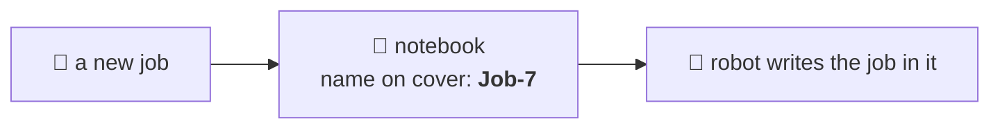
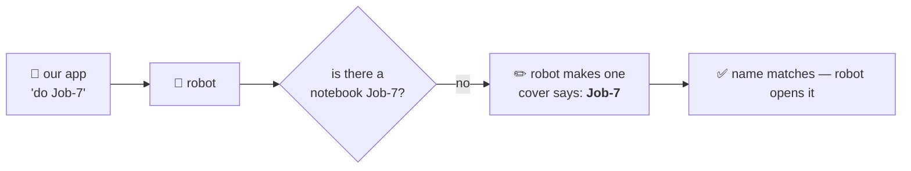
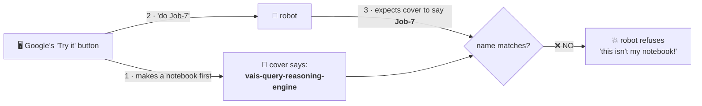
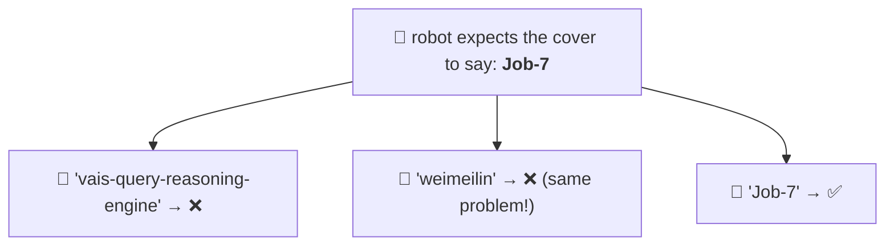
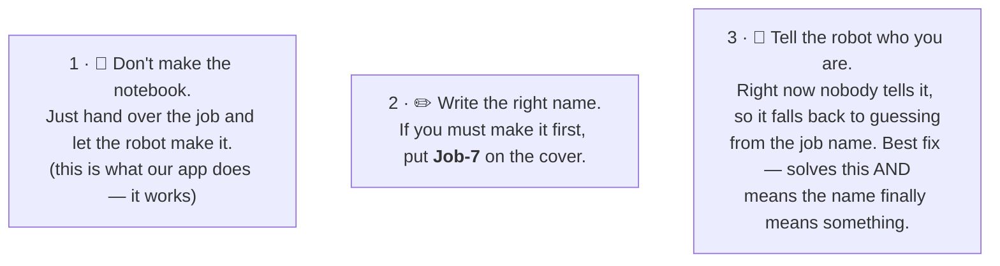
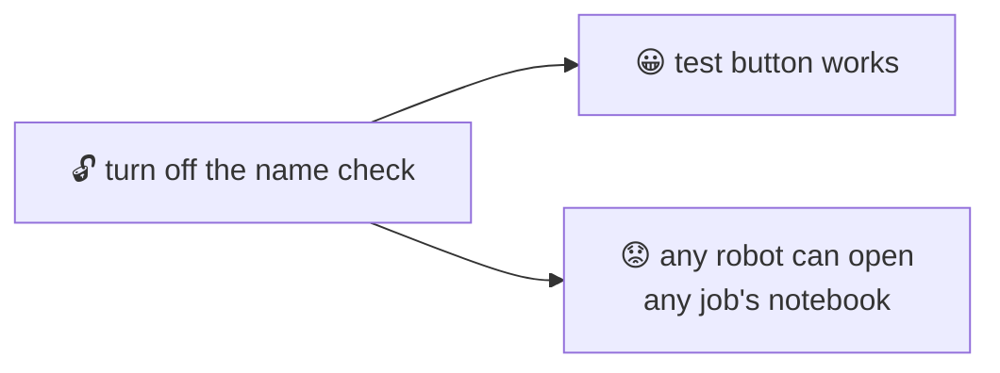
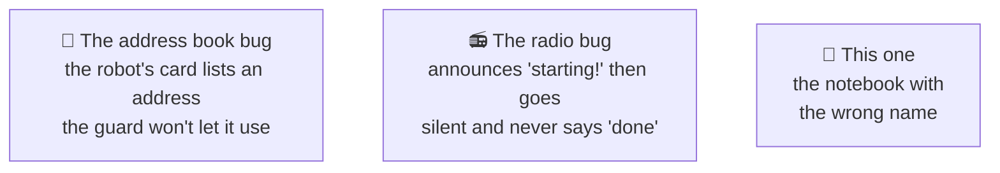

# The notebook with the wrong name on it — explained very simply

This is the simple version of **FINDING E** in
[`eng-report/UPSTREAM-FR-a2a-client-gaps.md`](eng-report/UPSTREAM-FR-a2a-client-gaps.md).
It's a bug we found in Google's platform and reported to them.

Related simple explainers: [`A2A-ELI5.md`](A2A-ELI5.md) (why we wrote our own messenger) ·
[`SSE-BUG-ELI5.md`](SSE-BUG-ELI5.md) (the radio that only announces the start) ·
[`TOKEN-AUTH-ELI5.md`](TOKEN-AUTH-ELI5.md) (the badges) ·
[`AGENTS-CLI-ELI5.md`](AGENTS-CLI-ELI5.md) (the visitor who knocks on a wall).

---

## The setup

Every time you give our robot a job, it gets a **notebook** to write the job in. The notebook has
a **name on the cover**, so the robot knows whose notebook it is and doesn't scribble in someone
else's.

The robot has **one strict rule**, and it's a good rule:

> 📓 *"I only open a notebook if the name on the cover is the name I expect."*

That's what stops the robot reading someone else's job by mistake.

---

## The normal way (this works fine)

When our own app gives the robot a job, it just says *"here's job **Job-7**"* and hands it over.
The robot looks for a notebook called **Job-7**, finds none, and **makes one itself** — writing
**Job-7** on the cover, because that's the job's name.

The robot wrote the cover itself, so of course the name matches. **It always works.**

---

## The broken way (Google's test button)

Google's console has a **"Try it" button** — a quick way to poke the robot without using our app.
But it does one extra thing first, and that one thing breaks everything.

It **makes the notebook itself, ahead of time** — and writes **its own name** on the cover:
`vais-query-reasoning-engine`. Then it hands the job to the robot.

The robot follows its good rule, sees the wrong name, and **stops**. The job fails before the
robot does any thinking at all.

**It fails every single time.** Not sometimes. Every time, for all six of our robots.

---

## The bit everyone guesses wrong

Most people hear this and say:

> *"Easy — make the button write **your** name on the cover instead of its own!"*

**That doesn't work.** 🙅

The robot isn't looking for *your* name. It's looking for **the job's name** — `Job-7` — because
that's the only name it knows how to expect. Writing `weimeilin` on the cover fails for exactly
the same reason `vais-query-reasoning-engine` does: it isn't `Job-7`.

So the real problem isn't *which* name is on the cover. It's that **somebody else made the
notebook at all.** The robot only accepts notebooks it wrote itself.

---

## How to actually fix it

Any one of these would do it — and all three are Google's to make, not ours:

---

## Could we fix it on our side?

Sort of — and we decided **not to**.

The only thing we could change is the robot's rule: *"open any notebook, don't check the name."*
But that's a **good rule**. It's what stops one job's notebook being read by another job. Turning
it off, to make a test button work, would be trading away something real for something
convenient.

We use our own app to run the robots, so we lose almost nothing by leaving the test button
broken. **We left the good rule on.**

---

## The one-sentence version

> Google's test button makes the robot's notebook for it and writes the wrong name on the cover —
> and the robot, quite correctly, refuses to open a notebook that isn't its own.

## Why this keeps happening

This is the **third** time we've found the same *shape* of bug: two pieces of Google's own
platform, each sensible on its own, that disagree about a detail when you plug them together.

None of them is anybody's *code* being wrong. Each is two teams' assumptions not lining up — which
is exactly the kind of bug you only find by actually building the whole thing.
