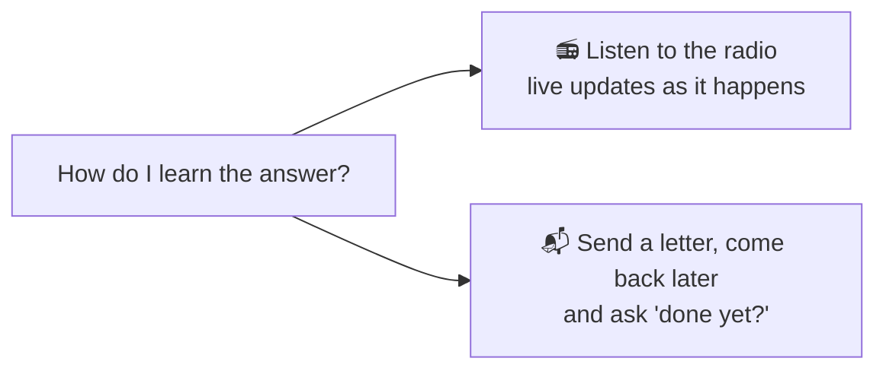
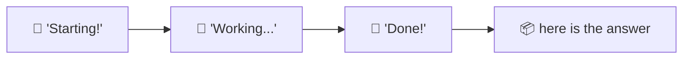
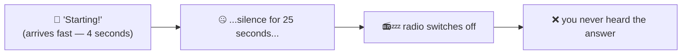
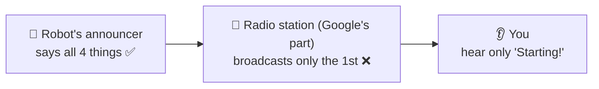
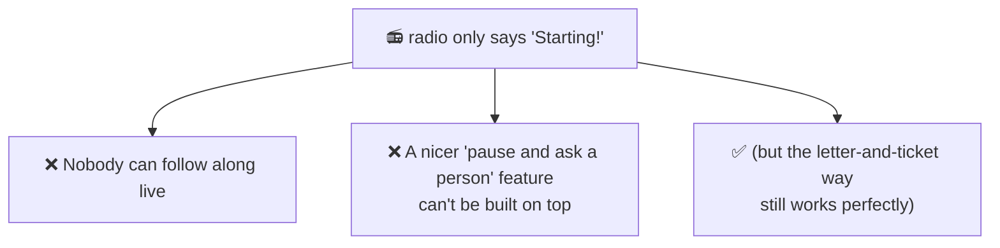

# The radio that only announces the start — explained very simply

This is the simple version of
[`eng-report/UPSTREAM-BUG-agent-engine-a2a-sse.md`](eng-report/UPSTREAM-BUG-agent-engine-a2a-sse.md).
It's a bug we found in Google's platform and reported to them.

Related simple explainers: [`A2A-ELI5.md`](A2A-ELI5.md) (why we wrote our own messenger) ·
[`TOKEN-AUTH-ELI5.md`](TOKEN-AUTH-ELI5.md) (the badges) ·
[`PLAYGROUND-BUG-ELI5.md`](PLAYGROUND-BUG-ELI5.md) (the notebook with the wrong name).

---

## The setup

Our robot helpers live in separate buildings, so when the boss robot gives one a job, it needs a
way to find out when the job is done.

There are **two** ways to find out:

This story is about the **radio** one, and why we can't use it.

---

## How the radio is supposed to work

The robot has a little announcer that reads out what's happening, live:

You tune in, you hear all four, you go away happy. That's how it works everywhere else.

## How it actually works

You hear **"Starting!"** — and then nothing, ever. Eventually the radio just turns itself off.

**But here's the thing: the robot really did finish the job.** If you walk over to the building and
ask at the desk, they hand you the finished work straight away. The answer existed the whole time.
Nobody ever said it out loud on the radio.

---

## Whose fault is it?

This is the important part, and it took real detective work.

There are three parties: the robot's **announcer**, the **radio station** in the middle (that's
Google's bit), and **you, listening**.

**It is not the robot.** We know this for two reasons:

1. **Take the same robot to a different building** (one we run ourselves) and its announcements
   come through perfectly — all four, every time. Same robot, same announcer. Only the radio
   station changed.
2. **We read the announcer's instructions** and it is clearly told to say all four things.

**It is not just a slow radio, either.** That was our first guess — maybe everything is queued up
and arrives late? No:

> The **first** announcement arrives in **4 seconds** — nice and quick. Then silence for **25
> seconds**. If the radio were merely slow or backed up, the *first* one would have been late too.
> It wasn't. So the station broadcasts the opening line and then simply stops passing things along.

We also checked it isn't our own building's security guard interfering — we ran the test from a
laptop, going straight to Google, with no guard in the middle. Same result.

---

## Why we care

The second one matters for the future: the polite way to have a robot stop and ask a human a
question relies on hearing those live announcements. No announcements, no clean way to build it.

> **🔎 A correction (2026-08-02).** An earlier version of this page also claimed the broken radio
> was why the ready-made toolkits couldn't fetch answers at all, and why we had to write our own
> messenger. **We tested that, and it was wrong** — a ready-made toolkit phoned a robot, waited
> three whole minutes, and got the complete answer. The radio bug is real and worth reporting, but
> it does **not** stop you getting results by the letter-and-ticket route. See
> [`A2A-ELI5.md`](A2A-ELI5.md) for what actually went wrong.

---

## What we asked Google to fix

1. **Please broadcast the whole game, not just the kickoff.** Say "working", say "done", and read
   out the answer — the same as every other building does.
2. **If you can't**, then at least have the ready-made toolkit be smart enough to walk over and ask
   at the desk when the radio goes quiet, instead of guessing.

Either one on its own would fix it for us.

**And one small extra:** a robot's "phone book entry" — the page that tells visitors what it can do
— isn't published at all unless you tick a particular box that isn't obvious. If you don't tick it,
nobody can look the robot up. We think that box should be ticked by default, or at least clearly
signposted.

---

## The one-sentence version

> The robot shouts "Starting!", finishes the job perfectly, and never gets to announce the result —
> because the radio station in the middle only broadcasts the first sentence and then goes quiet.
> (You can still walk over and collect the answer, which is what we do.)
