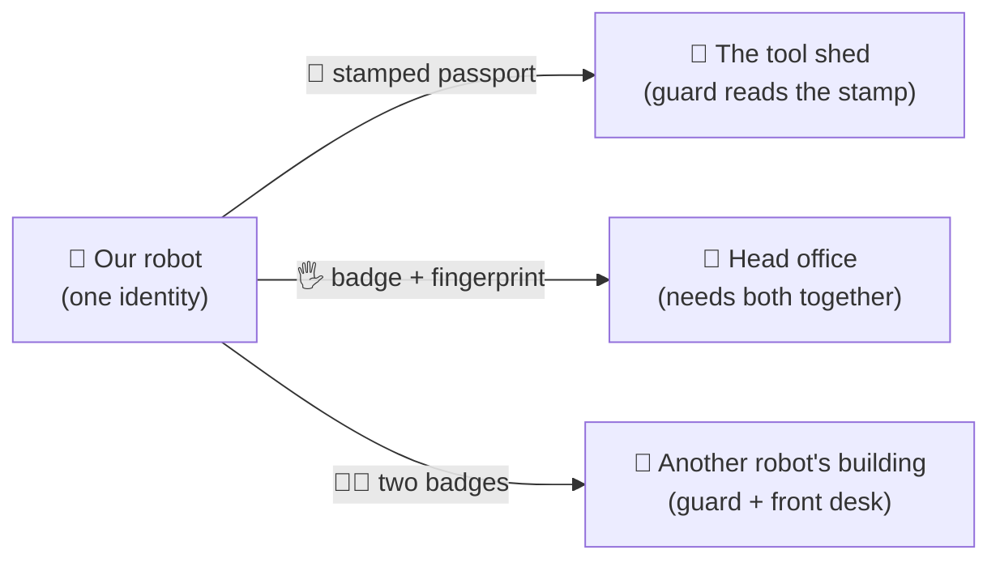
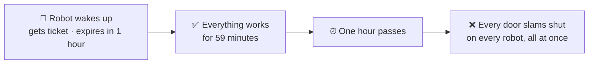
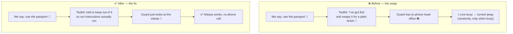
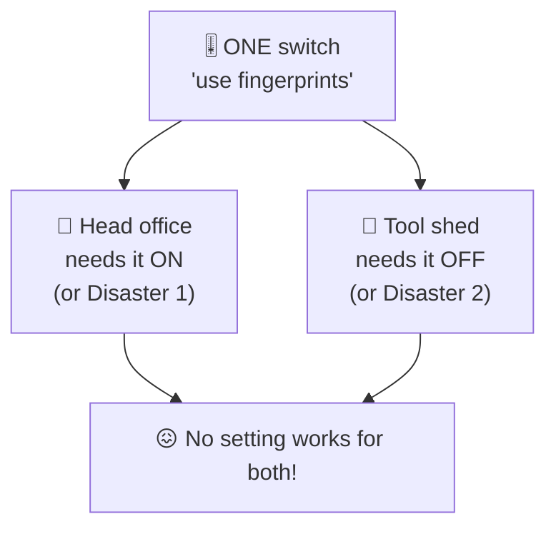
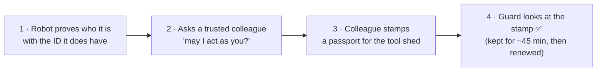

# The badge problem — explained very simply

This is the simple version of
[`eng-report/token-auth-postmortem.md`](eng-report/token-auth-postmortem.md).
Two things broke in production. Both are fixed. This explains what happened and why it was so
hard to see.

Related simple explainers: [`A2A-ELI5.md`](A2A-ELI5.md) ·
[`SSE-BUG-ELI5.md`](SSE-BUG-ELI5.md).

---

## The setup: one robot, three doors, three different ID checks

Our robot has **one identity** — it's one robot, it is who it is. But it has to get through three
different doors, and **every door checks ID a different way.**

The two kinds of ID matter a lot, so remember these:

| ID type | How the guard checks it | Reliable? |
|---|---|---|
| 📗 **Stamped passport** | **Looks at it.** The stamp proves itself. | ✅ Always works |
| 🎫 **Plain ticket** | **Phones head office** to ask "is this real?" | ⚠️ Fails when the phone lines are busy |

That difference — *look at it* vs *phone someone* — is the cause of the second disaster.

---

## Disaster 1: the badge that quietly expires after one hour

**What we wanted:** get the robot into the tool shed.

The robot's normal ID was the fancy fingerprint kind. But the tool shed's guard doesn't do
fingerprints — he just wants a plain ticket. So we flicked a switch that said:

> *"Stop giving this robot the fingerprint badge. Give it a plain ticket instead."*

It worked! The robot got into the tool shed. Job done. 🎉

**Except.** The plain ticket turned out to be a **photocopy handed out once, when the robot woke up
in the morning** — with an expiry time printed on it: **one hour.** And nobody ever makes a fresh
one.

So every robot worked perfectly for an hour, then **all of them** started getting turned away at
the head office at the same time.

**Why it was so horrible to diagnose:** being turned away looks *exactly* like "this robot isn't
allowed in here" — a permissions problem. We went hunting through the permission lists, which were
all completely correct. The real answer was "the ID is out of date, and nobody renews it." Also, it
never happened during testing, because testing never lasted a whole hour.

**The fix:** switch back to the fingerprint badge — that one gets **made fresh every single time**,
so it can never go stale.

**But** switching back broke the tool shed again. Which brings us to…

---

## Disaster 2: the helpful assistant who swaps your ID behind your back

So now we needed a *different* way into the tool shed. We wrote careful instructions:

> *"When you go to the tool shed, use the **stamped passport**."*

Good plan. It didn't happen — and we couldn't see why.

It turns out the **toolkit** we use (the robot's standard equipment) has its own rule buried
inside it:

> *"If the fingerprint switch is ON, I'll handle the door myself."*

And we had just turned that switch back on to fix Disaster 1. So the toolkit quietly **threw away
our stamped passport** and handed the guard a plain ticket instead — the very thing we were trying
to avoid.

**Why it only failed sometimes:** the guard only has to phone head office for a *plain ticket*.
When all our robots rushed the shed at once, the phone line got busy — so a few got turned away and
the rest sailed through. Classic "it works on my machine": it only breaks when things are busy.

**The fix:** politely tell the toolkit *"don't handle this door"*, so our passport instructions run
again. One small change.

---

## The trap underneath both disasters

Here's the thing that made this genuinely nasty, and it's worth understanding:

**One switch controlled two completely different things that needed opposite settings.** Turn it
on, the tool shed breaks. Turn it off, the head office breaks an hour later. There was no correct
value — which is why we had to reach in and change the toolkit's behaviour instead of just picking
a setting.

---

## Where the stamped passport comes from

One more wrinkle. Our robot **can't stamp its own passport** — it has no stamp of its own.

So it borrows one:

It works, and it's the officially suggested trick — but it is a *trick*, and every team doing this
has to invent it for themselves.

---

## What we asked Google to change

1. **When we say which ID to use, please use it.** Don't quietly swap it. *(Disaster 2)*
2. **Don't let one switch control two unrelated things** that need opposite settings. Give us two
   switches. *(the trap)*
3. **Make the stamped-passport trick a proper supported feature**, so nobody has to invent it.
4. **Warn us when an ID is about to go stale** — don't just start slamming doors an hour later and
   let it look like a permissions problem. *(Disaster 1)*

---

## The one-sentence version

> Our robot needs a different kind of ID for each door; the one switch that controls this needed to
> be ON for one door and OFF for another, and the toolkit kept swapping our good ID for a flaky one
> behind our back — so both failures showed up late, randomly, and disguised as something else.
