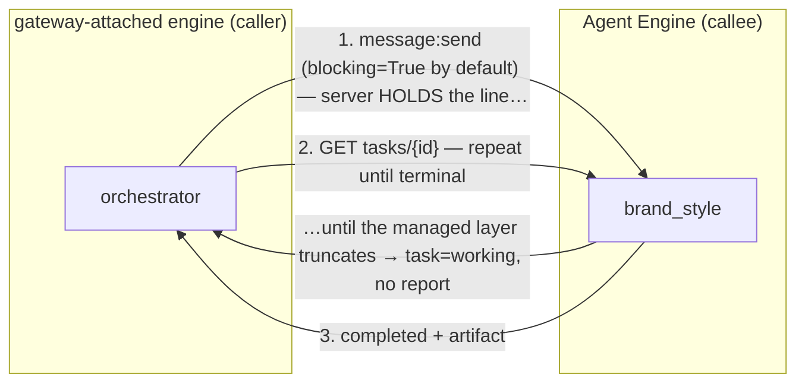
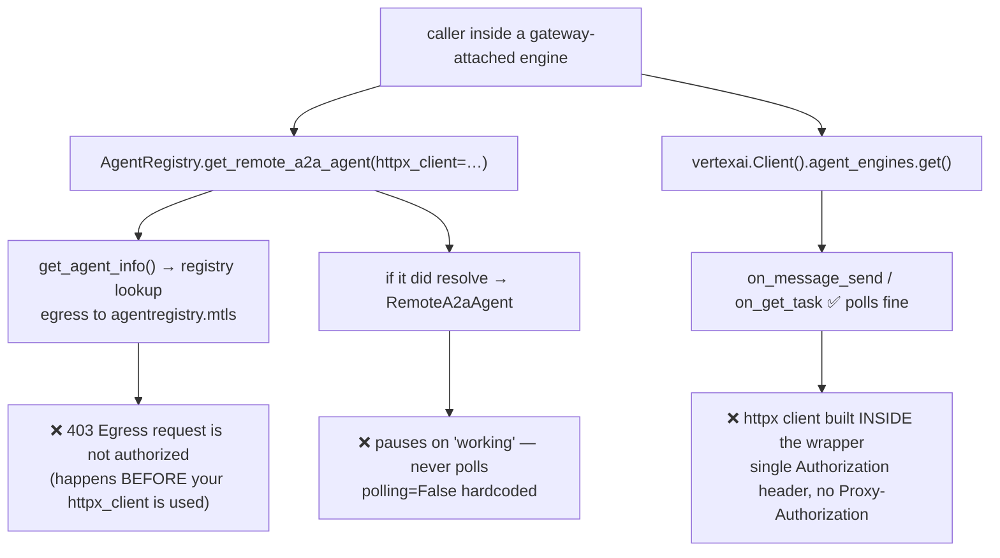

# Upstream Feature Request — no SDK path can make an in-engine, long-running A2A call

**Filed by:** vibeflix-audit (ADK multi-agent mesh on Agent Runtime, `pokedemo-test`)
**Date:** 2026-08-01
**Companion:** [`UPSTREAM-BUG-agent-engine-a2a-sse.md`](UPSTREAM-BUG-agent-engine-a2a-sse.md) ·
[`a2a-native-transport-findings.md`](a2a-native-transport-findings.md) (Appendix B)

## TL;DR

Calling one Agent Engine from **inside** another one — where the caller is gateway-attached and
the callee takes minutes — needs **three** properties at once:

1. **injectable auth** (a gateway-attached caller must send `Proxy-Authorization` *and*
   `Authorization`, and re-mint on expiry),
2. **a way to collect a result after the response is cut short** — see GAP-4: `message:send`
   defaults to `blocking=True` and the a2a-sdk server honours it, but the managed layer ends the
   HTTP response at an undocumented deadline and returns a non-terminal task,
3. **in-engine resolution** (the caller must be able to find the target without an egress hop the
   gateway blocks).

Google ships two client paths. **Each provides a different two of the three.** Neither provides
all three, so we maintain a ~320-line hand-rolled sender. We are not asking for a new product —
we are asking for **one small change to either path** to close its missing property.

| Path | inject auth | poll to terminal | resolve in-engine |
|---|:--:|:--:|:--:|
| `google.adk…AgentRegistry.get_remote_a2a_agent()` | ✅ | ❌ | ❌ |
| `vertexai.Client().agent_engines.get()` (`_genai`) | ❌ | ✅ | ✅ |
| our `vibeflix_common/a2a_engine.py` | ✅ | ✅ | ✅ |

## Environment

```
google-cloud-aiplatform 1.159.0     google-adk 2.3.0
a2a-sdk 0.3.26 (pinned by google-adk[a2a] <0.4)     Python 3.14
Agent Runtime engines, agent identity + agent_gateway_config (governed egress)
```

## The shape of the call we need



**Step 1 is not fire-and-forget by design — it is a blocking call that gets cut short.**
`MessageSendConfiguration.blocking` defaults to `True`, and the a2a-sdk server honours it
(`default_request_handler.py`: `blocking = True  # Default to blocking behavior`). The agent is
genuinely trying to hold the connection until terminal. The managed Agent Runtime HTTP layer ends
the response first and hands back whatever the aggregator has — a non-terminal task. Step 2 exists
only to recover the result the truncated step 1 was about to return.

Streaming is not an escape hatch either: per the companion SSE bug, the managed layer forwards
only the opening `submitted` event and then drops the stream. So **fetching the task afterwards is
the only mode that yields a completed long-running result.**

## Where each path breaks



---

## GAP-1 — `_genai` A2A wrapper hardcodes its HTTP client (no way to add `Proxy-Authorization`)

**Where:** `vertexai/_genai/_agent_engines_utils.py`, in `_wrap_a2a_operation`

```python
a2a_agent_card.url = f"{base_url}/{api_version}/{self.api_resource.name}/a2a"
config = ClientConfig(
    supported_transports=[TransportProtocol.http_json],
    use_client_preference=True,
    httpx_client=httpx.AsyncClient(                    # ← constructed internally
        headers={"Authorization": f"Bearer {self.api_client._api_client._credentials.token}"},
        ...
    ),
)
```

**Why it blocks us.** A gateway-attached caller must authenticate to **two** parties on one
request — `Proxy-Authorization` for the Agent Gateway (egress authorization, agent identity) and
`Authorization` for the target aiplatform endpoint. Sending only `Authorization` is exactly the
configuration that produced the 401s we chased for days. There is no parameter, subclass hook, or
config field that reaches this client. Additionally `_credentials.token` is read **once per call**
with no refresh, which is fragile across token expiry.

`base_url` *is* overridable (`vertexai.Client(http_options=HttpOptions(base_url=…))`, confirmed
accepted), so the **host** half is already solvable — only the headers are not.

**Requested change.** Accept a caller-supplied client or headers, e.g.

```python
client.agent_engines.get(name=…, httpx_client=my_client)
# or
vertexai.Client(..., a2a_header_provider=lambda ctx: {"Proxy-Authorization": f"Bearer {tok()}"})
```

This mirrors what ADK already does for `get_remote_a2a_agent(httpx_client=…)` — the precedent
exists in the sibling SDK.

---

## GAP-2 — `get_remote_a2a_agent` resolves *before* it uses your client, so in-engine callers 403

**Where:** `google/adk/integrations/agent_registry/agent_registry.py`

```python
def get_remote_a2a_agent(self, agent_name, *, httpx_client=None) -> RemoteA2aAgent:
    agent_info = self.get_agent_info(agent_name)          # ← registry lookup, FIRST
    ...
    return RemoteA2aAgent(..., httpx_client=httpx_client) # ← only used for LATER sends

def get_agent_info(self, name):
    return self._make_request(name)                       # ← the registry's own transport
```

**Why it blocks us.** From a gateway-attached engine, that resolution is an outbound call to
`agentregistry.mtls` — which the gateway filters → `403 Egress request is not authorized`.
Registering and granting `agentregistry` does not help; it is the gateway's own dependency.
The failure is at **resolution**, before the injected `httpx_client` is ever touched, so the
documented auth extension point cannot reach it.

**Requested change.** Either (a) route resolution through the caller-supplied `httpx_client` /
`header_provider`, or (b) provide a resolution-free constructor that takes the target's resource
name directly:

```python
registry.get_remote_a2a_agent(agent_name="…", httpx_client=c, skip_resolution=True)
# or
RemoteA2aAgent.from_engine(resource_name="projects/…/reasoningEngines/ID", httpx_client=c)
```

---

## GAP-3 — `RemoteA2aAgent` cannot complete a request/response that outlives the hold window

**Where:** `google/adk/agents/remote_a2a_agent.py` (~536-542); also visible in the registry
fallback path, which constructs `AgentCapabilities(streaming=False, polling=False)`.

**Why it blocks us.** The client is hardcoded to `polling=False` and treats a `submitted` /
`working` task as a **pause** (it emits a mock function call), rather than fetching
`GET tasks/{id}` to a terminal state. Combined with GAP-4 — the managed layer truncating a
*blocking* send — every hop whose work outlives the hold window stalls at `pending` and the caller
receives a non-answer. Hops that finish inside the window return complete results, so the failure
presents as intermittent rather than systematic: in our mesh the three dispatch agents worked
natively while `contract_finalize` returned `cleared` with no contract, on identical code.

**Requested change.** A `polling=True` mode that fetches to terminal with backoff, and a way to
distinguish a genuine `input_required` pause (HITL — where pausing *is* correct) from "still
working". Today those two are indistinguishable to the caller, which is the root of the silent
wrong answer.

---

## GAP-4 — the request deadline that truncates a blocking send is neither configurable nor documented

**What happens.** `MessageSendConfiguration.blocking` defaults to `True`; the a2a-sdk server
implements it faithfully:

```python
blocking = True  # Default to blocking behavior
if params.configuration and params.configuration.blocking is False:
    blocking = False
...
await result_aggregator.consume_and_break_on_interrupt(consumer, blocking=blocking, ...)
```

The agent therefore *intends* to answer in one request/response. The managed Agent Runtime HTTP
layer ends the response first and returns a non-terminal task. This is server-side, not a client
timeout: the server actively **returns** a `working` task, and our direct SSE probe observed a
server-side close ~24.9s into a longer job.

**Why it blocks us.** The protocol's own blocking contract is silently overridden, so a compliant
A2A client that trusts `blocking=True` gets a non-answer with no error. That is precisely how
GAP-3 manifests as a wrong result rather than a failure.

**No knob exists.** Searched every Agent Engine config type in
`google-cloud-aiplatform 1.159.0`: `CreateAgentEngineConfig` exposes `min_instances`,
`max_instances`, `resource_limits`, `container_concurrency`, `keep_alive_probe` (container
*liveness*, not a request deadline), and no timeout/deadline field. A scan of every
agent-engine type for `timeout|deadline|duration` matched only unrelated objects (prompts,
datasets, custom-job `Scheduling`). The only lever available is making the agent finish *faster*
(more cpu/concurrency) so it fits under an unknown limit.

**Requested change (any one of these):**
1. **Honour `blocking=True`** for the request's lifetime, or
2. **expose the deadline** as deployment config (e.g. `request_timeout` on the deployment spec), or
3. at minimum **document its value**, so callers can reason about which hops may use blocking at
   all — and return an explicit "deadline exceeded, poll for the result" signal rather than a bare
   non-terminal task that is indistinguishable from a HITL pause.

---

## BUG-A — legacy `vertexai.agent_engines` A2A ops silently become `None`

**Where:** `vertexai/agent_engines/_agent_engines.py` (~line 122-147)

Nine a2a names are imported in **one** `try/except (ImportError, AttributeError)`, and
`TransportProtocol` is taken from `a2a.utils.constants` — a **1.x-only** location. On a2a-sdk
0.3.x (which `google-adk[a2a] 2.3.0` pins) that import fails, so **all nine become `None`** and
every A2A operation is a silent stub:

```
TypeError: 'NoneType' object is not callable    # at _agent_engines.py:1748
```

It fails at *call* time with no hint that a dependency was missing. The newer
`vertexai/_genai/_agent_engines_utils.py` already does this correctly — it version-detects and
imports from the right module per version (`a2a.compat.v0_3.types` on 1.x). **Requested change:**
apply the `_genai` version-detection to the legacy module, or raise a clear
`ImportError` naming the missing package instead of nulling the names.

**Related:** the legacy wrapper also hard-raises `"Streaming is not supported in Agent Engine"`
when the agent card advertises `capabilities.streaming: true`. Our engines' registered cards do,
so that path refuses them outright. (The `_genai` path accepts the same card.)

---

## DOC-A — the two load-bearing egress facts are undocumented

The [Agent Gateway overview](https://docs.cloud.google.com/gemini-enterprise-agent-platform/govern/gateways/agent-gateway-overview)
describes the policy model (IAP enforcement, IAM-authorized destinations only, agent identities
"secured by default … using mTLS and DPoP") but documents **neither**:

- that a gateway-attached caller must send **`Proxy-Authorization`** in addition to
  `Authorization` (omitting it yields a `401` that reads like a missing client certificate), nor
- that the call must target the **`.mtls`** host, because the gateway authorizes only the
  destination it has registered (the plain host yields `403 Egress request is not authorized`
  even when the caller holds `roles/iap.egressor` on the endpoint).

Both were found only by measurement. Documenting them would save every team on this path the same
multi-day diagnosis.

---

## What we do today (the workaround we would like to delete)

`vibeflix_common/a2a_engine.py` — ~320 lines:

```python
POST {mtls_host}/v1beta1/{engine}/a2a/v1/message:send     # dual auth headers
GET  {mtls_host}/v1beta1/{engine}/a2a/v1/tasks/{id}       # poll to terminal, re-mint on 401
```

Fixing **GAP-1 alone** would let us replace it with the `_genai` client plus a short poll loop.
Fixing **GAP-2 + GAP-3** would let us use the documented `AgentRegistry` path. Either is sufficient.

## Evidence appendix — verified, not inferred

Against a live engine (`vibeflix-ui-renderer`, `4545326643400409088`), from a non-gateway caller:

```
vertexai.Client(...).agent_engines.get(name=…)
  bound ops: on_message_send · on_get_task · on_cancel_task
             on_message_send_stream · on_resubscribe_to_task · handle_authenticated_agent_card
  on_message_send(...) → 1 chunk in 8.7s: Task(state=submitted) + TaskStatusUpdateEvent
  on_get_task(id=…)    → t+9.2s state=completed → full artifact returned
```

This proves the `_genai` send+poll pair works and is the right shape; GAP-1 is the only thing
stopping it from being usable **from inside** a gateway-attached engine.
