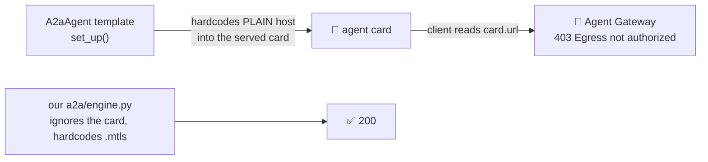
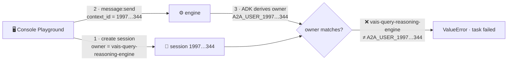

# Upstream Bugs — six gaps in A2A on Agent Runtime

**Filed by:** vibeflix-audit (ADK multi-agent mesh on Agent Runtime, `pokedemo-test`)
**Date:** 2026-08-02, updated 2026-08-18 · Supersedes two earlier drafts of this file, both wrong.
**Severity:** High — **no standard A2A client can make an agent-to-agent call** from a
gateway-attached engine, and the cause is not user-configurable.

| # | Finding | Component |
|---|---|---|
| **A** | The `A2aAgent` template advertises a host the Agent Gateway refuses (the headline bug, below) | Agent Runtime template |
| **B** | Legacy `vertexai.agent_engines` A2A ops silently become `None` | `google-cloud-aiplatform` |
| **C** | `AgentRegistry` needs `google-adk[agent-identity]`, and only says so at call time | `google-adk` |
| **D** | A blocking `message:send` dies at ~180s, reporting a healthy engine as failed | Agent Runtime serving |
| **E** | The console Playground hands the engine a session the engine must reject | Console + `google-adk` |
| **F** | `agents-cli run` cannot reach an `A2aAgent` engine — it addresses routes that do not exist there | `google-agents-cli` |

**The pattern is the point.** Every one is a defect *between two Google components* — template vs
gateway, SDK vs SDK, console vs ADK — and every one appears only once you deploy with the
`A2aAgent` template. Individually each is a papercut; together they mean the documented,
prebuilt A2A path does not work on Agent Runtime without user-space workarounds.

## The defect in one paragraph

`vertexai/agent_engines/templates/a2a.py` hardcodes the **plain** aiplatform host into the agent
card it serves, overwriting whatever URL the deployer set. The **Agent Gateway refuses the plain
host** — it authorizes only the `.mtls` host. Every standard A2A client resolves its transport URL
from the card. So the platform advertises a destination its own gateway blocks, and the deployer
cannot change it.



## The evidence chain — every link verified

| # | Link | How established |
|---|---|---|
| 1 | The template hardcodes the plain host and overwrites the deployer's URL | **Source**: `templates/a2a.py:328` builds `https://{location}-aiplatform.googleapis.com/...`, then `:342` `self.agent_card.supported_interfaces[0].url = new_url` |
| 2 | The deploy-time card URL is genuinely ignored | **Measured**: we deployed a probe whose `agent_card(url=…)` was set to the **mtls** host; the served card still returned the **plain** host |
| 3 | The gateway refuses the plain host | **Measured in-engine**: `message:send` to the plain host with **both** `Authorization` and `Proxy-Authorization` → `403 Egress request is not authorized`, against **3 different peer agents** |
| 4 | The gateway allows the mtls host | **Measured in-engine**: same call to `.mtls` with a **single** `Authorization` header → `200`, against the same 3 peers, on **both** `message:send` and `message:stream` |
| 5 | A2A clients follow the card | **Source**: `a2a/client/transports/rest.py:57` `self.url = agent_card.url`, then `f'{self.url}/v1/message:send'` |
| 6 | Result: the SDK client 403s in-engine while a raw mtls call succeeds | **Measured in-engine**, same run, same credentials |

**The control makes this readable.** Our own `a2a_engine_send()` ran inside the same probe, in the
same execution, against the same targets, and **succeeded** — so grants, identity, targets and
deploy are all known-good. It works precisely because it ignores the card and calls `.mtls`.

## Reproduction

Deploy any ADK agent via the `A2aAgent` template to a gateway-attached engine, then from **inside**
another such engine:

```python
# fails: 403 Egress request is not authorized  (client follows the card → plain host)
eng = vertexai.Client(project=P, location=L).agent_engines.get(name=TARGET)
await eng.on_message_send(role="user", parts=[{"kind":"text","text":"hi"}],
                          messageId="x", kind="message")

# succeeds: 200  (same engine, same credential, .mtls host)
requests.post(f"https://{L}-aiplatform.mtls.googleapis.com/v1beta1/{TARGET}/a2a/v1/message:send",
              headers={"Authorization": f"Bearer {tok}"}, json=body)
```

Grants were exactly what `grant_agent_iam.sh` gives a production agent (7 project roles,
`iap.egressor` on 20 registered `GCP *` endpoints incl. all four `agentregistry` variants, and on
all six agent endpoints), plus 5 minutes for IAP propagation.

## ✅ WORKAROUND — verified in production, uses the stock framework

**You do not have to accept the platform's card.** `RemoteA2aAgent` takes an `AgentCard`
*object*, and `RestTransport` prefers an explicit url over the card's. Build the card yourself,
point it at `.mtls`, and the documented ADK client works from inside a gateway-attached engine:

```python
from a2a.types import AgentCapabilities, AgentCard
from google.adk.agents.remote_a2a_agent import RemoteA2aAgent

card = AgentCard(
    name="ui-renderer-via-mtls",
    description="...",
    url=f"https://{REGION}-aiplatform.mtls.googleapis.com/v1beta1/{ENGINE}/a2a",  # ← the fix
    version="1.0.0",
    capabilities=AgentCapabilities(streaming=False),
    default_input_modes=["text/plain"], default_output_modes=["text/plain"],
    preferred_transport="HTTP+JSON", skills=[],
)
agent = RemoteA2aAgent(name="peer", description="...", agent_card=card,
                       httpx_client=httpx.AsyncClient(auth=GoogleAuth()))
```

**Measured in the same probe run, same engine, same credentials, same target:**

| client | card | result |
|---|---|---|
| `_genai` `on_message_send` | platform's (plain host) | ❌ 403 Egress not authorized |
| `_genai` `on_message_send` (self-target) | platform's (plain host) | ❌ 403 Egress not authorized |
| **stock `RemoteA2aAgent` + Runner** | **self-built (mtls host)** | ✅ **200 — 1127 chars of real A2UI** |

That is a controlled A/B: the only variable is which host the card names.

**Caveats before adopting it wholesale** — the A/B above proves the *transport*, not a drop-in
replacement:
- the A/B used a **fast** target (~9s). A long hop in-engine through a **blocking** send
  **fails** — see FINDING D. Anything that can exceed ~180s needs a non-blocking send plus poll.
- **Finding 3** of `a2a-native-transport-findings.md` still applies:
  `_construct_message_parts_from_session` discards the explicit brief passed to `run_node`. That
  is independent of transport, and any hop dispatched via `ctx.run_node(agent, brief)` needs the
  override.

### End-to-end confirmation (2026-08-02, full production mesh)

The A/B above is a single hop. The workaround has since been adopted for **every** orchestrator
dispatch hop and exercised by a complete audit driven at the orchestrator engine — so all three
hops below were made **by a gateway-attached engine**, not from a laptop:

| hop | path | result |
|---|---|---|
| `orchestrator → brand_style` | self-built card, stock blocking send | `compliant`, 3 checks run |
| `orchestrator → deal_pricing` | self-built card, stock blocking send | `APPROVED`, rate card + 3 components |
| `orchestrator → vendor_clearance` | self-built card, **non-blocking send + poll** | `cleared`, fanned into `legal` |
| `contract_finalize` | raw `a2a_engine_send` | executed contract `LC-662784` |

**301.4s wall clock, 6662-char aggregate report, zero errors** — no `403 Egress request is not
authorized`, no `FAILED_PRECONDITION`, nothing at ERROR severity across all six engines. The two
blocking-path engines went quiet ~80s into the run while `vendor_clearance` and `legal` kept
logging to the end, which is the expected split: the fast hops finish well inside the ceiling,
and the one hop that can pass it runs on the poll path. That is the load-bearing result: **the
stock ADK client works engine-to-engine at any duration, provided you give it a card naming
`.mtls` and let long hops poll.**

## Requested fix

**Primary:** make the template advertise the host the gateway authorizes — the `.mtls` endpoint —
or make the card URL respect what the deployer set instead of overwriting it. Either removes the
need for every user to hand-roll a transport.

**Secondary:** `_genai`'s `_wrap_a2a_operation` assigns `a2a_agent_card.url` from the client's
`base_url`, but overriding `base_url` to `.mtls` still failed — the fetched card's interface entry
(pinned by link 1) appears to take precedence in `ClientFactory`. If the override is meant to work,
it should also update the interface list. *(This last link is read from source, not isolated by
measurement.)*

---

# The other findings, each measured independently

## FINDING B — legacy `vertexai.agent_engines` A2A ops silently become `None`

`vertexai/agent_engines/_agent_engines.py` imports nine a2a names in **one**
`try/except (ImportError, AttributeError)`, taking `TransportProtocol` from `a2a.utils.constants`
— a **1.x-only** location. On a2a-sdk 0.3.x (pinned by `google-adk[a2a] 2.3.0`) that import fails,
so **all nine become `None`** and every A2A op is a silent stub:

```
TypeError: 'NoneType' object is not callable      # _agent_engines.py:1748
```

No hint that a dependency was missing. The newer `_genai/_agent_engines_utils.py` already
version-detects correctly (`a2a.compat.v0_3.types` on 1.x). **Fix:** apply that detection to the
legacy module, or raise a clear `ImportError` naming the package.

## FINDING C — `AgentRegistry` needs `google-adk[agent-identity]`, and only says so at call time

On an Agent-Identity engine:

```
ImportError: Missing required dependencies for Agent Identity Auth Manager.
Please install with: pip install "google-adk[agent-identity]"
```

…raised at **call** time, not import. The `[a2a]` extra alone is insufficient. **Fix:** declare it
where it's used, or surface it at import.

---

# Retractions — claims from earlier drafts we no longer stand behind

Recorded so reviewers don't chase them. All were refuted by production testing.

| Earlier claim | Status |
|---|---|
| Registry resolution 403s from a gateway-attached engine | ❌ **Refuted** — `list_agents()` in-engine returned 10 agents and built a `RemoteA2aAgent`. Our original 403 was a **grant gap** (`gcp-agentregistry`, all 4 variants), which our own IAM script's comments already admit. |
| `Proxy-Authorization` is required for in-engine A2A | ❌ **Refuted** — mtls + `Authorization` alone → 200. |
| `RemoteA2aAgent` can't complete a long-running hop | ⚠️ **Refuted from a laptop, then RE-CONFIRMED in-engine — then fixed.** The 180.4s / 7590-char success was a **laptop** run, which is not gateway-attached. In-engine the same hop came back **empty at ~180s**; FINDING D shows why (the client got `400 FAILED_PRECONDITION` and our agent swallowed it, so the caller saw emptiness rather than the error). True of a **blocking send** — but not of the client, which completes a long hop fine once it sends non-blocking and polls. |
| A platform deadline truncates a blocking `message:send` | ⚠️ **Superseded by FINDING D.** "Held 180s" was the laptop again. In-engine it does not merely hold — it **fails** at ~180s with `400 FAILED_PRECONDITION`. |
| The gateway refuses `message:stream` | ❌ **Refuted** — raw SSE to `.mtls` → 200 on all three peers. |
| The card's `capabilities.streaming: true` steers clients into a refused path | ❌ **Refuted** — a `streaming=False` target still 403'd. |

> **Two of these retractions were themselves wrong**, and the reason is the same both times:
> they were established from a **laptop**, which is not behind the Agent Gateway and does not hit
> the ~180s ceiling. Only the four ❌ rows are safe. This is why every claim in this report is
> now labelled with *where* it was measured.

**On the failure that started all of this** — `contract_finalize` returning `cleared` with no
contract — an earlier draft blamed our **Finding 3** (the brief-drop). **That attribution is
withdrawn.** `contract_finalize` calls `a2a_engine_send` directly and never constructs a
`RemoteA2aAgent`, so Finding 3 cannot reach it; and a rollback test reproduced the same
no-contract audits on the pre-migration code. The contracts *do* execute — the id fails to reach
the report. **Root cause still open**, but note it is **intermittent, not constant**: the
2026-08-02 end-to-end run logged `[orchestrator] contract_finalize: executed LC-662784` on the
success branch. Any future diagnosis has to explain why it sometimes lands and sometimes doesn't,
which rules out a plain "the id is never propagated" explanation.

## FINDING D — a blocking `message:send` dies at ~180s, blaming the callee

**Measured in-engine, 2026-08-02.** A `message:send` carrying
`configuration: {blocking: true}` — which is what every stock a2a client sends — held for
**180.2s** and then returned:

```json
{"error": {"code": 400, "status": "FAILED_PRECONDITION",
  "message": "Reasoning Engine Execution failed.\n…\nError Details: "}}
```

No task, no state, and **`Error Details:` empty**. Meanwhile the target engine was working
normally: 62 log lines, dispatching to three peers with trace propagation, writing to the task
store, zero errors. The same request **without** `blocking` returns in **0.9s** with a
`TASK_STATE_SUBMITTED` task, and polling `tasks/{id}` retrieves the completed result.

Three separate runs landed at 180.4s / 180.7s / 180.2s, so the boundary is consistent. We cannot
say whether it is a deadline, a proxy limit, or something in the blocking path — the platform
does not say, and **no timeout/deadline field exists** on `ReasoningEngineSpec.deploymentSpec`
(checked against the live v1beta1 discovery document: `agentGatewayConfig`, `agentServerMode`,
`containerConcurrency`, `env`, `keepAliveProbe`, `maxInstances`, `minInstances`,
`pscInterfaceConfig`, `resourceLimits`, `secretEnv` — nothing else).

**Requested:** (a) don't report a healthy engine's execution as *failed* — the message sends
users hunting a failure that never happened; (b) populate `Error Details`, or return a distinct
status such as `DEADLINE_EXCEEDED`; (c) document the limit, or expose it as deployment config;
(d) ideally, offer a non-blocking mode on the stock client so callers can poll.

## FINDING E — the console Playground hands the engine a session the engine must reject

**Measured 2026-08-04**, orchestrator engine `3932837094078021632`. Clicking **Run** in the Agent
Engine console Playground fails **every time, on every A2A-deployed engine**, with:

```
ValueError: Session 1997178965374009344 does not belong to user A2A_USER_1997178965374009344.
```

### The chain — three Google components, no user code involved

| # | What happens | Evidence |
|---|---|---|
| 1 | The Playground **pre-creates a session** under its own fixed identity | `GET …/sessions/1997178965374009344` → `"userId": "vais-query-reasoning-engine"`, `createTime 14:03:12.736078Z` |
| 2 | The Playground then calls the engine over A2A, passing **that session's id as the A2A `context_id`** | engine log: `POST /api/a2a/v1/message:send` from a Google IP, `context_id: 1997178965374009344` |
| 3 | ADK **discards the caller** and synthesizes a user id from the context id | **Source**: `a2a/converters/request_converter.py:76` → `return f'A2A_USER_{request.context_id}'` |
| 4 | `_prepare_session` looks the session up under that synthetic id | **Source**: `a2a/executor/a2a_agent_executor.py:356` → `get_session(user_id=…, session_id=…)` |
| 5 | `VertexAiSessionService` enforces ownership and raises | **Source**: `sessions/vertex_ai_session_service.py:249` compares, `:251` raises |

The failure landed at `14:03:24.595` — **12 seconds after step 1**, in the same request flow. The
task was then written to the task store as `state=failed`.



### Why this is deterministic, not flaky

`GOOGLE_CLOUD_AGENT_ENGINE_ID` is injected by Agent Runtime into every engine, so every engine
builds its `Runner` with `VertexAiSessionService` — the only session service that enforces
ownership. Any engine deployed with the `A2aAgent` template therefore fails this way 100% of the
time. In our mesh that is all six.

### ⚠️ This is NOT a "wrong user" bug — and that matters for the fix

The obvious reading is that the Playground should pass the *human's* identity instead of a service
identity. **That would not fix it.** ADK does not compare against the caller at all; it compares
against a value it derives from the context id. A human identity mismatches
`A2A_USER_{context_id}` exactly as a service identity does. The real defect is structural: **ADK's
A2A path treats the context id as the sole authority on session ownership, so the only session it
will ever accept is one it created itself** — and the Playground hands it one it didn't.

This is also why our own app is unaffected: it generates a fresh `context_id`, no session
pre-exists, `get_session` 404s → returns `None` → ADK creates the session under
`A2A_USER_{context_id}`, and owner and requester agree by construction. Verified: a full
production audit over the same path runs clean.

### Requested fix — any one of these, all Google-side

1. **Don't pre-create the session.** Let the Playground send a fresh `context_id` and let the
   engine create the session, exactly as any other A2A client does. Provably sufficient — it is
   precisely what our app does.
2. **Conform to the convention.** If the Playground must pre-create, create it as
   `A2A_USER_{session_id}`.
3. **Populate the authenticated caller into the A2A call context** (best). ADK's `_get_user_id`
   *prefers* `request.call_context.user.user_name` and only falls back to the synthetic id when
   that is absent. The managed A2A server never populates it. Fixing this resolves the bug **and**
   makes session identity meaningful instead of synthetic.

### Separate concern, worth its own look

Even setting the failure aside, the Playground drives engines as the **shared fixed identity**
`vais-query-reasoning-engine` rather than as the signed-in human. Every console user's sessions
therefore land under one identity, so Playground-driven runs have no per-user isolation and no
attribution. That is a weakness independent of this bug, and option 3 above fixes both.

## FINDING F — `agents-cli run` cannot reach an `A2aAgent` engine

**Measured 2026-08-18**, `google-agents-cli` 1.4.0 (also reproduced on 1.3.1 — the routing is
identical), against a healthy `A2aAgent` engine. Google's own agent CLI cannot talk to an engine
deployed with Google's own A2A template, in **either** of its two modes.

```
$ agents-cli run --url https://us-central1-aiplatform.googleapis.com/v1/projects/…/reasoningEngines/… \
    --mode adk --app-name brand_style "Audit this mock-up…"

Error: Failed to create Agent Runtime session (HTTP 404):
  "Reasoning Engine Execution failed. … Error Details: {"detail":"Not Found"}"
```

### The routes do not overlap

| | Path the client requests | Result |
|---|---|---|
| `--mode adk` | `<resource>:streamQuery` (`run/cmd_run.py:362`) | 404 — the A2A template serves no ADK SSE endpoint |
| `--mode a2a` | `…/reasoningEngines/v1/<resource>/api/a2a/<app_name>/.well-known/agent-card.json` (`_agent_runtime_a2a.py:28-44`) | **404** (verified by curl) |
| `--mode a2a`, app-name guessed as the agent dir | `…/api/a2a/brand_style/.well-known/agent-card.json` | **404** (verified by curl) |
| **what the engine actually serves** | `…/v1beta1/<resource>/a2a/v1/card` | **200** ✓ |
| | `…/v1beta1/<resource>/a2a/v1/message:send` · `/a2a/v1/tasks/{id}` | ✓ (our client uses these in production) |

Two independent differences: the **API version segment** (`reasoningEngines/v1` vs `v1beta1`) and
the **mount point** (`/api/a2a/<app_name>` vs `/a2a/v1`).

### No flag can bridge it

This is the part that makes it a defect rather than a documentation gap. `--url` is **not used
verbatim**: `is_raw_agent_runtime_url()` recognises any Agent Runtime URL and rebuilds the path
itself, so a caller cannot supply the correct one. `--app-name` only fills the `<app_name>`
segment of a prefix that is already wrong. There is no combination of flags that reaches
`/v1beta1/<resource>/a2a/v1/`.

### Root cause

`agents-cli` targets engines deployed by `agents-cli deploy` or `adk deploy agent_engine`, which
mount each agent under its **directory name**. Engines created through `vertexai`'s
`agent_engines.create()` with the `A2aAgent` template mount A2A at a **versioned protocol path**.
Both are supported, first-party deploy paths; the client knows only one of them.

### Requested fix — any one of these

1. **Probe both layouts.** Try `/v1beta1/<resource>/a2a/v1/card` when the ADK-style card 404s.
   Cheapest fix, no interface change.
2. **Honour `--url` verbatim** when the caller supplies a full path, instead of rebuilding it.
   Lets a user work around any future divergence without a client release.
3. **Publish the route on the engine.** The engine knows how it was deployed; expose the A2A base
   in `reasoningEngines.get` so clients resolve it instead of guessing.

Option 1 unblocks users today; option 2 is the one that stops this recurring.

### Impact

The CLI is the documented way to smoke-test a deployed agent. For A2A-template engines it fails
with `404 … {"detail":"Not Found"}`, which reads as *"your agent is broken"* rather than *"this
client is looking in the wrong place"* — and the engine is fine, as the same request against
`/a2a/v1/message:send` proves by returning a full report. We replaced the CLI with a ~30-line
script over our own A2A client (`deploy/ask_agent.py`).

---

## What a user has to build to work around all of this

Both defects (the plain-host card, and the 180s blocking ceiling) are absorbed in one subclass so
call sites stay idiomatic — this is the shape any team on Agent Runtime will end up writing:

```python
class VibeflixRemoteA2aAgent(RemoteA2aAgent):
    async def _resolve_agent_card(self):
        card = await super()._resolve_agent_card()
        card.url = self._mtls_base            # FINDING A: the served card names a host the
        return card                           #            gateway refuses

    def _construct_message_parts_from_session(self, ctx):
        _, context_id = super()._construct_message_parts_from_session(ctx)
        return self._parts_from(ctx.user_content), context_id   # brief, not session history

    async def _run_async_impl(self, ctx):
        if not self._long_running:
            async for e in super()._run_async_impl(ctx):        # stock path
                yield e
            return
        yield await self._send_and_poll(ctx)   # FINDING D: blocking dies at ~180s
```

`long_running=True` is needed on any hop that can exceed ~180s; the fast dispatch hops (~9-20s)
run the stock path unchanged. The point of folding it into the same class is that **the call site
does not branch on transport** — same constructor, same `ctx.run_node`, one boolean:

```python
return VibeflixRemoteA2aAgent(name=name, description=description, agent_card=base,
                              long_running=name in _LONG_RUNNING_A2A)
```

**Where it is actually used (2026-08-02).** All three orchestrator dispatch hops go through this
one class: `brand_style` and `deal_pricing` on the stock path, `vendor_clearance` with
`long_running=True` (it fans into legal's multi-round Q&A loop). **Three** callers remain on the
poll sender directly (`a2a_engine_send`, or the thin `direct_engine_agent` wrapper around it)
rather than the subclass, because none of them is a `ctx.run_node` dispatch — there is no agent
for the subclass to be:

| caller | why not the subclass |
|---|---|
| `contract_finalize` | a one-shot engine→engine send from inside a tool |
| `app → orchestrator` | the app is Cloud Run, driving the mesh from outside |
| `vendor_clearance → legal` | called from a tool, and needs a fresh context per clarification round |

## Why our workaround exists

`vibeflix_common/a2a/engine.py` calls `{mtls}/v1beta1/{engine}/a2a/v1/message:send` directly and
polls `tasks/{id}`. Given the defect above, **hardcoding the mtls URL is the only reason it works**
— it never reads the card. The poll loop is a separate, independent robustness choice.

> **Note on our own code:** `a2a/engine.py` sends `Proxy-Authorization` in-engine and its comments
> call it required. Measurement says otherwise (single `Authorization` on `.mtls` → 200). Harmless,
> but the comment overstates it; the 401 it was added to fix was most likely the *missing*
> `Authorization` header, which the same change also introduced.
