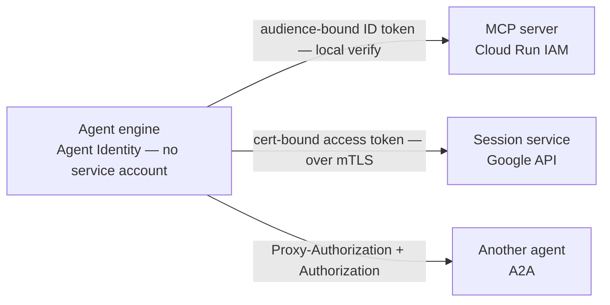
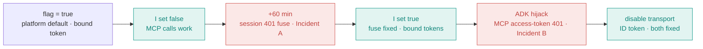
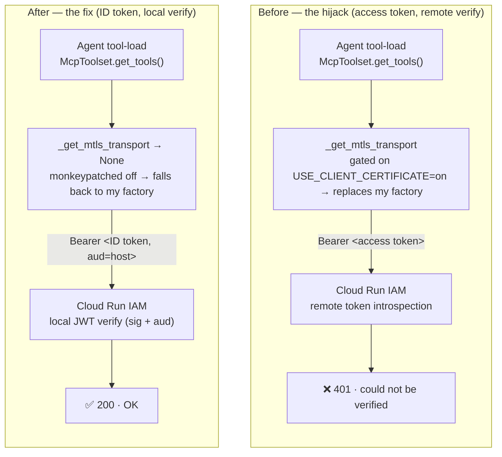
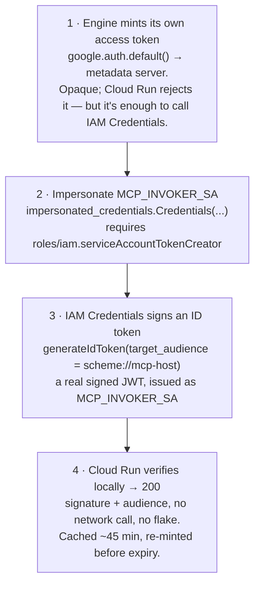

# Agent Identity, MCP & A2A — the token model that reshaped my agent code

> **Engineering report · Auth & token model**
> Scope: `vibeflix-audit` · Vertex Agent Engine · Agent Gateway
> Status: both root causes fixed & verified · Audience: Platform / ADK engineering

Running ADK agents under **Agent Identity** — no service account, behind a governed gateway — means one
process must speak **three different token dialects** to three destinations. The platform's own defaults set
them against each other. Here is exactly what broke, why, and what engineering should change so the
workarounds are not necessary.

---

## 0 · The shape of the problem — one process, three destinations, three tokens

Each agent runs as an Agent-Engine reasoning engine with **Agent Identity**: it has *no* service account
behind the metadata server — its principal is `principal://…/reasoningEngines/<id>`. From that one identity it
must call out to three fundamentally different places, and **each accepts a different kind of token**.



- **ID token** — signed JWT, verified **locally** (signature + audience). Never flakes.
- **Access token** — opaque, verified **remotely** (introspection). Flakes under load.

Two production incidents came out of this. Both were, at root, **the wrong token reaching the wrong
verifier** — and the second was *caused by the fix for the first*.

---

## 1 · Incident A — the 60-minute fuse, and why I turned off the default that caused it

**The sequence at a glance** — each fix created the next break until the final decoupling:



**Start with the decision, because it is the real origin of everything that followed.** My first goal was
simply to get the MCP calls working. The platform default is
`GOOGLE_API_PREVENT_AGENT_TOKEN_SHARING_FOR_GCP_SERVICES = true`, which gives each engine a
**certificate-bound** token. A bound token is only valid over an **mTLS channel to Google's own endpoints** —
presented as an ordinary bearer to a plain-IAM Cloud Run MCP, it is refused. So I flipped the default to
`false`. That gave me a plain, **shareable** access token Cloud Run would accept, and the MCP calls started
going through. Problem solved — or so it looked.

> ⚠️ **The chronology engineering needs:** I *deliberately turned the
> default off* to unblock MCP. The 60-minute fuse below is the direct, delayed consequence of that one change
> — which is exactly why nothing looked wrong until an hour of runtime had passed.

**Symptom.** Every engine worked for about an hour after a replica booted, then began returning `401` on its
session-service calls to `*.aiplatform.googleapis.com` — all at once, fleet-wide, looking exactly like a
permissions problem even though the IAM policy was correct.

**Root cause.** With sharing allowed — my `false` — `google.auth.default()` on an engine with no service
account takes the platform's **shared, pre-minted access token**, frozen at replica boot with a fixed
`exp = boot + 60min`. The library treats it as valid until expiry and *never re-mints* it, so sixty minutes
in every call presents a dead token. The very setting that made MCP accept my bearer is the setting that
froze the session token.

**The fix.** Put the default back: `PREVENT_AGENT_TOKEN_SHARING = true` (with `USE_CLIENT_CERTIFICATE`), so
google-auth attaches a `bindCertificateFingerprint` and re-mints per request against the workload's SPIFFE
cert. Fuse gone. But restoring the default cost me the plain bearer that had made MCP work — so MCP now needed
a different solution entirely. **That is where Incident B begins.**

---

## 2 · Incident B — the MCP hijack: ADK swaps my ID token for the flaky access token

**Symptom.** Intermittent `401 "the access token could not be verified"` when an agent loaded its MCP tools.
It failed a tool-load, which hung the whole audit — but only under the concurrent fan-out, so it looked like
a load or network flake.

**Root cause.** ADK's `MCPSessionManager._get_mtls_transport` builds an mTLS transport whenever
`GOOGLE_API_USE_CLIENT_CERTIFICATE != "false"` — the exact flag I turned on for Incident A. That transport
authenticates MCP with `google.auth.default().token` (the agent's **access token**) and **replaces the
`httpx_client_factory` I supplied**. So my ID-token logic never ran for MCP. And Cloud Run *remotely*
introspects access tokens — a network call that flakes under load. An ID token is a signed JWT Cloud Run
verifies *locally* and never flakes.



**The flag collision — one global, two subsystems.** The session service (via `google.auth`) needs
`USE_CLIENT_CERTIFICATE ≠ false` for bound tokens. ADK's MCP transport reads the *same* variable and, when
it's on, forces its own access-token transport. **There is no value of the flag that satisfies both.**

**The fix: disable the transport, not the flag.** Neutralise only ADK's MCP transport, leaving the flag on
for the session service:

```python
# vibeflix_common/mcp_clients.py — runs at import, cloud only
def _disable_adk_mcp_mtls():
    # ADK builds an mTLS transport that authenticates MCP with the agent ACCESS
    # token and replaces my httpx factory. My MCP servers are plain IAM Cloud Run,
    # not mutual-TLS — so disable it.
    async def _no_mtls(self):
        return None
    MCPSessionManager._get_mtls_transport = _no_mtls
    # → ADK falls back to mcp_httpx_factory (GoogleAuth → audience-bound ID token).
    # The session service uses google.auth directly and is untouched.
```

Verified across every run since: zero `could not be verified` 401s, and my ID-token factory firing on every
engine.

---

## 3 · Where the ID token actually comes from

The reason the correct path needs custom code at all: an Agent-Identity engine **cannot sign an OIDC ID token
itself** — there is no service account for the metadata server to sign with, so `fetch_id_token()` can't
work. I bootstrap one by impersonating a real service account, `MCP_INVOKER_SA`. (Trick I learn from a codelab linked from the documentation https://codelabs.developers.google.com/cloudnet-agent-gateway)



Put together, the three destinations resolve like this — and it is *correct* for them to differ; they are
different verifiers with different trust models:

| Destination | Token | Verified | Who mints it |
|---|---|---|---|
| Agent → **MCP** (Cloud Run IAM) | audience-bound **ID token** | locally (JWT) | impersonate `MCP_INVOKER_SA` |
| Agent → **Session** (Google API, mTLS) | cert-bound **access token** | remotely, cert-bound | `google.auth`, bound to SPIFFE cert |
| Agent → **Agent** (A2A) | `Proxy-Authorization` + `Authorization` | gateway, then target | gateway token + minted target token |

---

## 4 · How much agent code this forced on me

None of the below is business logic. It exists solely to make one identity present the right token to the
right verifier — the plumbing the platform's defaults left undone or actively fought:

- A custom `httpx_client_factory` (`GoogleAuth`) that attaches the two A2A headers and the audience-bound ID
  token per request.
- An **ID-token minting chain** via `impersonated_credentials` — because Agent Identity can't sign OIDC for a
  Cloud Run target.
- A **monkeypatch of ADK internals** (`_get_mtls_transport → None`) to stop the framework overriding my auth.
- A two-header A2A engine client, plus token-refresh mid-poll (a long legal escalation outlives a cached
  token).
- A cluster of **global env flags with cross-subsystem side effects** that must be set as a matched set and
  read back on every engine after every deploy.

> **The trap for the next engineer:** every one of these fixes lives *outside* the agent's business code, is
> invisible at review time, and fails *intermittently* and *silently* — a dropped token reads as a network
> flake; a hijacked transport reads as a load error. The 60-minute fuse and the concurrency-only MCP 401 both
> survived initial testing precisely because they don't fire on the happy path.

---

## 5 · Back to engineering — what the platform should change

So that the next team doesn't rediscover this from a 401:

1. **The MCP session manager must honour the caller's `httpx_client_factory`.** Building an mTLS transport
   that silently replaces a supplied factory — and authenticating with an access token to a plain-IAM Cloud
   Run target — is the entire root cause of Incident B. At minimum it should be opt-out independently of
   `USE_CLIENT_CERTIFICATE`.
2. **Stop overloading one global flag across subsystems.** `GOOGLE_API_USE_CLIENT_CERTIFICATE` drives both
   google-auth's bound tokens and ADK's MCP transport, with opposite correct values. These need separate
   switches.
3. **Give Agent Identity a first-class ID-token path for Cloud Run.** Every team calling an IAM-gated Cloud
   Run service from an identity-only engine will hand-roll the same `MCP_INVOKER_SA` impersonation. It should
   be a supported call, not a recipe.
4. **Make the shared-token fuse observable.** A credential that silently freezes at `boot + 60min` and only
   fails an hour later should surface as a warning, not as a blanket 401 that mimics an IAM misconfiguration.

**Bottom line.** MCP and A2A didn't just add endpoints — they changed *what the agent code is responsible
for*. The identity is fixed, but the token it must present is a function of the destination, and the
framework's defaults optimise one destination at the expense of another. Until the platform separates those
concerns, the workarounds in this report are load-bearing.

---

*vibeflix-audit · token & auth postmortem · both root causes fixed and verified in production ·
workarounds live in `packages/vibeflix-common/vibeflix_common/`: `mcp_clients.py` · `cloud_auth.py` ·
`a2a_engine.py`. See also `deploy/docs/instruction-sre.md`.*
